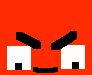
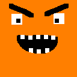

# Blog Post #4 Dev Update 2

## Introduction

The aim of this blog post is to detail more the development progress for the GMD's final project. This blog post covers details about adding enemies inside the game, adding decorations to the level, and adding the game logic to completing a level and instantiating the levels.

## Adding Enemies

Enemies are an important feature of this game. Their graphic was designed using Photoshop, following the same procedure as for the player. The game involves two types of enemies: regular enemies and bosses. After creating the graphics for these, I went ahead and created prefabs using these. The prefabs then were updated with the required components for the upcoming logic regarding enemies, which involves components such as BoxCollider2D, Rigidbody2D and scripts such as [EnemyBehavior](../gmd-final-project/Assets/Scripts/Enemy/EnemyBehavior.cs), [EnemyMovement](../gmd-final-project/Assets/Scripts/Enemy/EnemyMovement.cs) and [Health](../gmd-final-project/Assets/Scripts/Health/Health.cs).

The logic for the enemies involve several actions. Regular enemies are placed around the level. Their logic involves patroling certain areas until they become aware of the player. Once the player is in range of the enemies to become aware of, the enemies start chasing the player. The logic for this action involves moving towards the player, while also predicting the future location of the player, offering a more dynamic interaction when going to attack the player. Once at a minimum attack distance, the enemies start attacking the player at a certain interaval between the attacks. This damages the player, and pushes him back. The player can riposte and attack the enemies back, pushing them behind as well when being hit. Further, if the player leaves the enemies behind a certain distance by running away from them, the enemies start patroling again, until becoming aware of the player once again.

The bosses in this game work as the final enemies before going to the next level. These would spawn only after all regular enemies are defeated. Spawning with more health and more damage to be dealt to the player, this entity brings a challenge at the end of a level. Pictures of the two types of enemies can be found in the table below.

| Regular Enemy                                 | Boss Enemy                                |
| --------------------------------------------- | ----------------------------------------- |
|  |  |

## Level Additions and Logic

The levels involve certain decorations scattered around, which can be smashed by the player for extra points. Along them, [hearts](../gmd-final-project/Assets/Scripts/Health/HealthItem.cs) can be found around rooms to heal the player, offering better chances at survival throughout the level. The logic for instantitaing the level involves instantiating the level prefab based on the player's progess. Once the player finished a level, the next level can be accessed through a portal. The logic can be found in these classses: [GameManager](../gmd-final-project/Assets/Scripts/GameManagers/GameManager.cs) & [LevelManager](../gmd-final-project/Assets/Scripts/GameManagers/LevelManager.cs). The levels come with a spawn point for the player and a spawn point for the portal once the boss/es are defeated.
